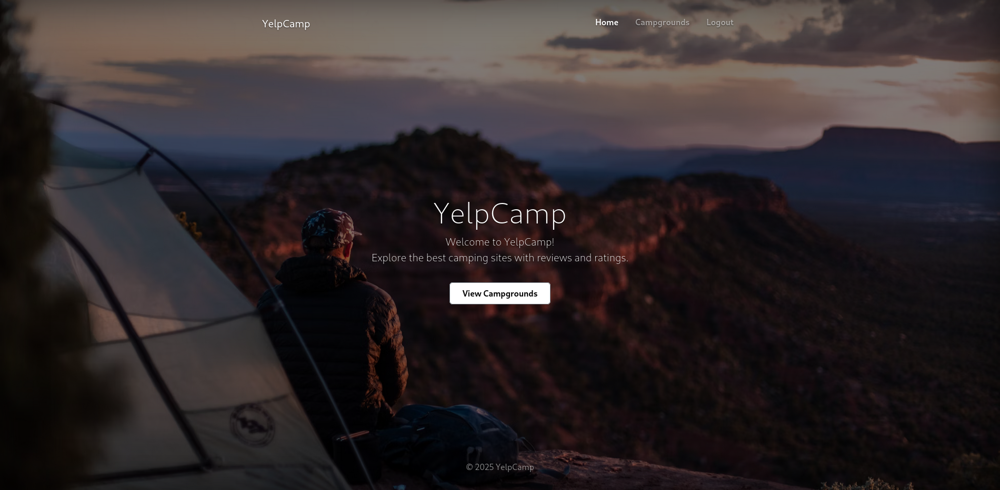
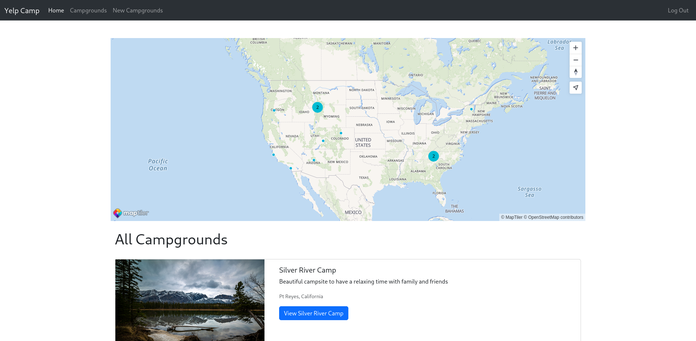
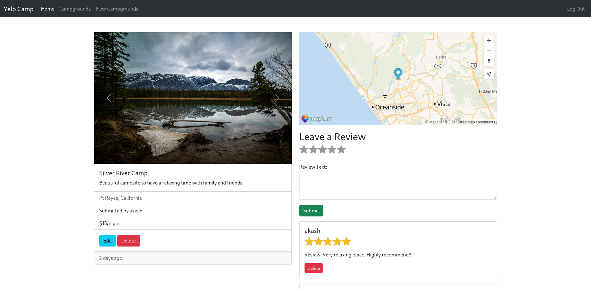

# Yelp Camp

Yelp Camp is a full-stack web application where users can browse, create, and review campgrounds. It features authentication, authorization, and a fully functional map integration.

## Screenshots





_(Replace the paths above with the actual paths to your images in the repository)_

## Features

- User authentication & authorization (Register, Login, Logout)
- Add, edit, and delete campgrounds
- Review and rate campgrounds
- Image upload with Cloudinary
- Map integration using Mapbox
- Responsive design

## Tech Stack

- **Frontend**: EJS, Bootstrap, JavaScript
- **Backend**: Node.js, Express.js, MongoDB
- **Database**: MongoDB (Atlas for production, local for development)
- **Authentication**: Passport.js
- **File Storage**: Cloudinary
- **Maps**: Mapbox
- **Hosting**: Render

## Installation

1. Clone the repository:

   ```sh
   git clone https://github.com/akash2003git/yelp-camp.git
   cd yelp-camp
   ```

2. Install dependencies:

   ```sh
   npm install
   ```

3. Set up environment variables (`.env` file):

   ```env
   CLOUDINARY_CLOUD_NAME=your_cloud_name
   CLOUDINARY_API_KEY=your_api_key
   CLOUDINARY_API_SECRET=your_api_secret
   MAPBOX_TOKEN=your_mapbox_token
   DB_URL=your_atlas_collection(Ignore if you want to run locally)
   ```

4. Run the application:
   ```sh
   node app.js
   ```
   The server will run at `http://localhost:3000`

## Database Configuration

In `app.js`, the database URL is set up as:

```js
const dbUrl = process.env.DB_URL || "mongodb://127.0.0.1:27017/yelp-camp";
```

This ensures that if `DB_URL` is not set in the environment, the application defaults to the local database.

## Deployment

The project is deployed on Render. You can access it here:

🔗 **Live Demo**: [Yelp Camp on Render](https://yelp-camp-au8z.onrender.com/)
